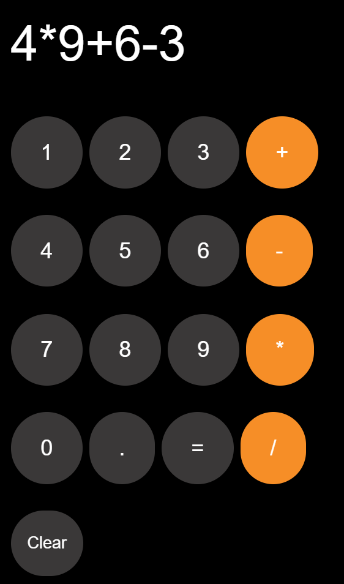

# 🧮 Calculator

A simple and interactive **Calculator** built using **HTML, CSS, and JavaScript**. This project performs basic arithmetic operations, displays calculations and results in real time, and stores the latest calculation using Local Storage for a seamless user experience.

---

## 📌 Features

- ➕ Perform Addition
- ➖ Perform Subtraction
- ✖️ Perform Multiplication
- ➗ Perform Division
- 🔢 Decimal number support
- 🧹 Clear button to reset calculations
- 💾 Saves the latest calculation using Local Storage
- ⚡ Displays results instantly on the calculator screen
- 🎨 Clean and responsive user interface

---

## 🛠️ Technologies Used

- HTML5
- CSS3
- JavaScript (Vanilla JS)
- Local Storage API

---

## 🚀 Live Demo

🔗 **Live Demo:** https://sanjanasripada12.github.io/Calculator/

---

## 📸 Screenshots

### Calculator Interface



---

## 📂 Project Structure

```text
Calculator/
│
├── index.html
├── style.css
├── script.js
├── Calculator.png
└── README.md
```

---

## 🚀 How to Run

1. Clone the repository

```bash
git clone https://github.com/SanjanaSripada12/Calculator.git
```

2. Open the project folder

```bash
cd Calculator
```

3. Open `index.html` in your browser.

No installation or additional libraries are required.

---

## 📖 How It Works

1. Click the number buttons to enter values.
2. Select an arithmetic operator (**+**, **−**, **×**, or **÷**).
3. Continue entering the second number.
4. Click the **=** button to calculate the result.
5. Use the **C** button to clear the display and start a new calculation.
6. The latest calculation is automatically saved using Local Storage.

---

## 💡 Future Improvements

- ⌨️ Keyboard input support
- 🧮 Scientific calculator mode
- 📜 Calculation history
- 🌙 Dark/Light Mode toggle
- 📱 Improved mobile responsiveness
- 📋 Copy result to clipboard
- 🎨 Multiple calculator themes

---

## 👩‍💻 Author

**Sanjana Sripada**

GitHub: **https://github.com/SanjanaSripada12**

---

## ⭐ Show Your Support

If you like this project, please consider giving it a ⭐ on GitHub!
